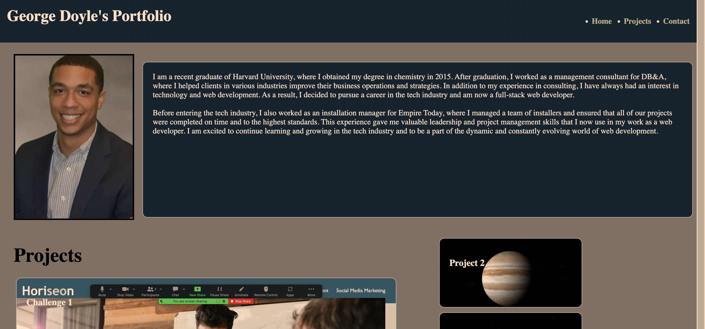

# Professional-Portfolio-2

My Website
Welcome to my website!

Header Navigator
At the top of the page, you'll find the header navigator. This allows you to easily navigate to different sections of my website, such as the About Me section or the Projects section.

Portrait Photo
Below the header navigator, you'll find a portrait photo of me. This photo gives you a sense of who I am and what I look like.

About Me
In the About Me section, you can learn more about me, my background, and my interests. This section also includes my contact information, so you can easily get in touch with me.

Projects
In the Projects section, you'll find a list of my most recent projects. This section is a great way to see some of the work I've done and get a sense of my skills and experience.

Footer
At the bottom of the page, you'll find the footer. The footer includes my contact information, as well as links to my social media profiles and any other relevant information.

If you have any questions or would like to get in touch with me, please don't hesitate to contact me using the information in the footer. I'd love to hear from you!
